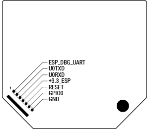
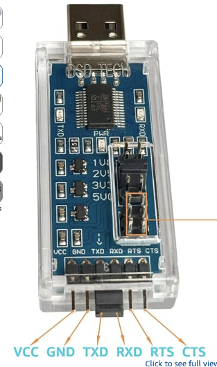
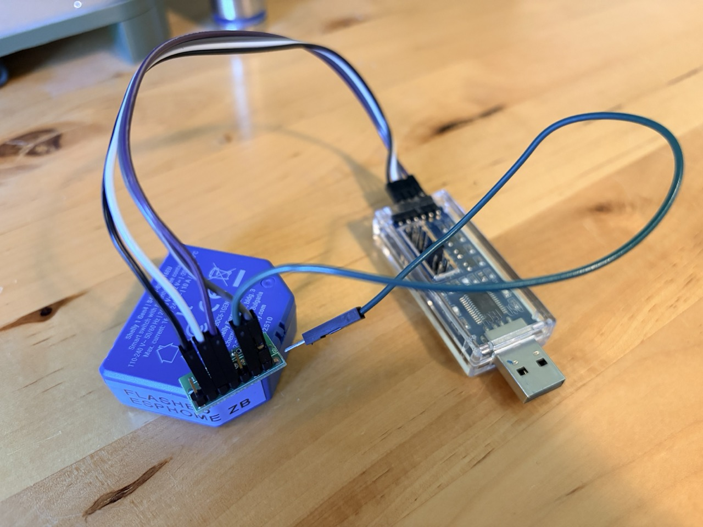
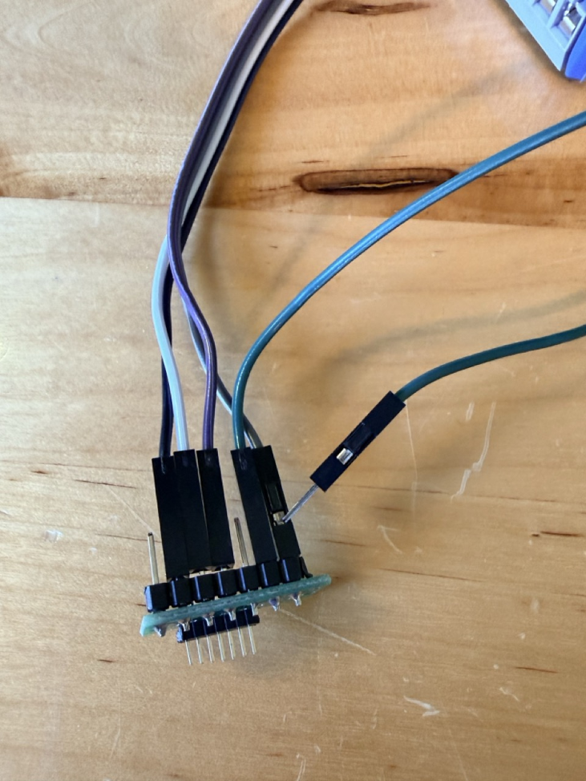
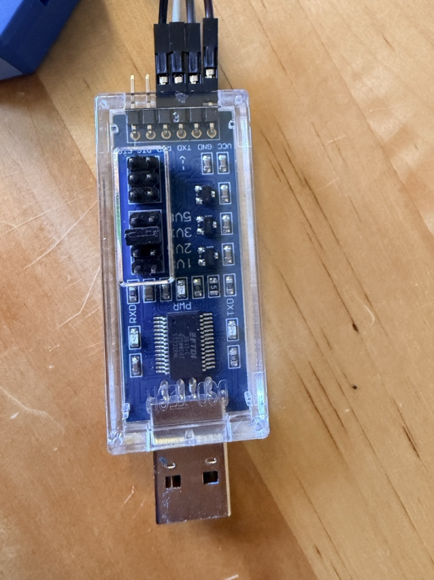
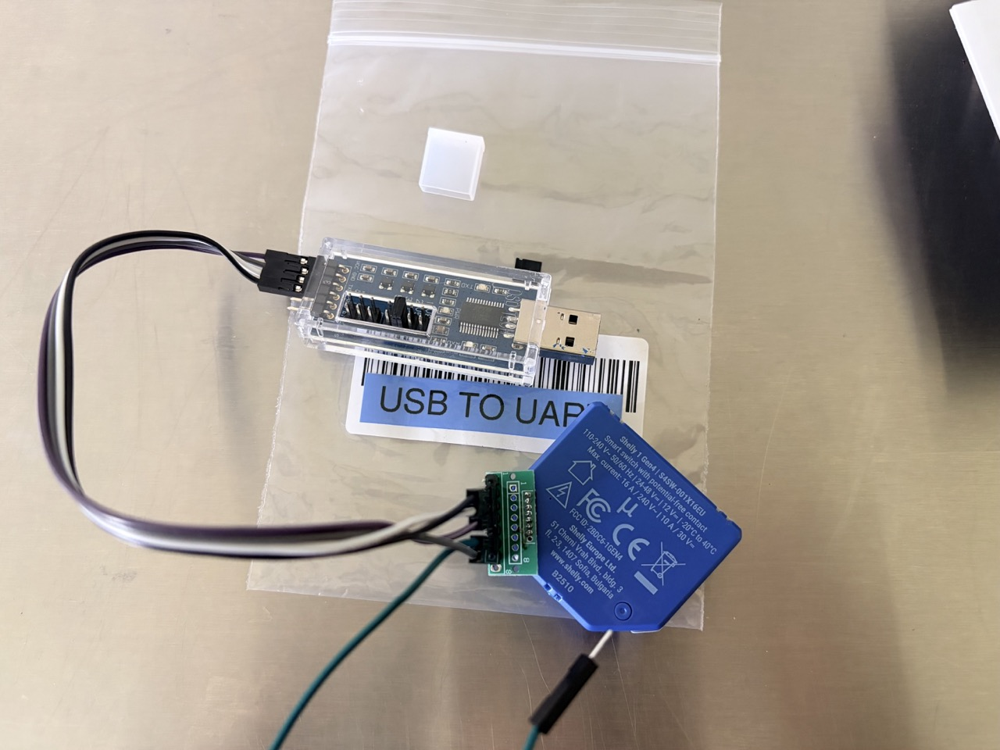
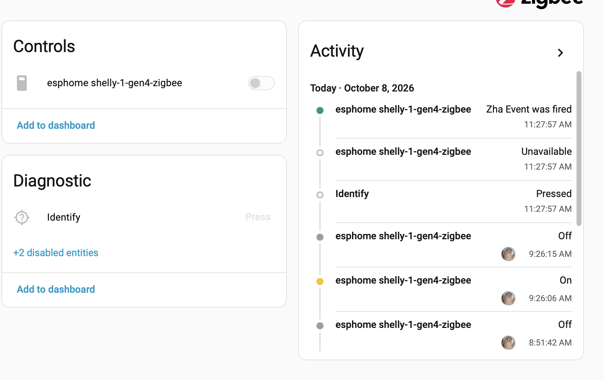

# Shelly 1 Gen4 with ESPHome and Zigbee

Use a **Shelly 1 Gen4** as a local Zigbee relay with ESPHome firmware and Home Assistant's **Zigbee Home Automation (ZHA)** integration.

> [!CAUTION]
> **Mains-voltage equipment can cause serious injury, fire, or death.** Disconnect the Shelly completely from mains power before opening it or connecting a USB-to-UART programmer. Do not flash the device while it is connected to mains. If you are not qualified to work safely with this hardware, do not attempt this procedure.

## Why this project?

When Shelly launched their Gen 4 relays with zigbee, I was genuinely excited. I prefer
Zigbee devices because they are inherently local. They can never be paywalled,
locked out, feature reduced, or cancelled.

When I finally got one, I learned the truth. They work fine on Zigbee, but firmware
updates (At least through ZHA) were gated to Wifi. That’s right… If you want new
firmware, you need to run two protocols. If you turn off Wifi and change your mind
later, your only recourse is to reach inside a live electrical box and press the relay
button.

I wanted a Zigbee only device with a ZHA upgrade path. I settled on ESPhome
because its simple and recently adopted more comprehensive zigbee controls. I got
my Shelly 1 Gen 4 paired with ZHA and the relay works in attached mode.

This project was inspired by [automatous-io's Shelly 1 Gen4 Matter over Thread project](https://github.com/automatous-io/shelly-1-gen4-matter-thread). Shelly's product documentation is available in the [Shelly knowledge base](https://kb.shelly.cloud/knowledge-base/shelly-1pm-gen4).

## What works

- Shelly 1 Gen4 joins Home Assistant ZHA over Zigbee.
- The relay is exposed as a standard On/Off switch.
- The external switch input toggles the relay.
- The onboard button can toggle the relay; a longer press can reset/rejoin Zigbee.
- Firmware can be updated using ESPHome's flashing tools rather than relying on Wi-Fi for normal operation.

The configuration below is the version documented in these notes and uses the [`luar123/zigbee_esphome`](https://github.com/luar123/zigbee_esphome) external component. ESPHome's native Zigbee support is evolving; verify the implementation and configuration against the ESPHome version you intend to use before flashing. **This example documents serial backup and flashing; it does not configure OTA firmware updates over Zigbee.**

## Hardware required

The main job is making a reliable, reversible connection between the Shelly's 1.27 mm programming pads and the 2.54 mm pins commonly found on USB-to-UART adapters.

| Item | Example | Approx. price (October 2026) |
|---|---|---:|
| USB-to-UART converter | [Example adapter](https://www.amazon.com/dp/B07WX2DSVB) | $15 |
| 1.27 mm to 2.54 mm pin-pitch adapter | [Example adapter board](https://www.amazon.com/dp/B09DGJVST6) | $7 |
| 1.27 mm and 2.54 mm pin headers | [Example headers](https://www.amazon.com/dp/B0CTKCWNGK) or [2.54 mm headers](https://www.amazon.com/dp/B07R5QDL8D) | ~$10 |
| Dupont jumper cables | [Example cable kit](https://www.amazon.com/dp/B01EV70C78) | $7 |

The Shelly 1 Gen 4 has 1.27mm pitch pins while USB to UART adapters have 2.54mm
pitch pins. I had a cheap adapter board, but I’ve seen sewing pins, 3d printed pogo pin
alignment boards, and many other ways to get this to work. You need a secure way to
connect 4 pins from Shelly to the USB adapter and a quick reversible way to bridge
the Shelly’s GPIO00 Pin to Ground to enter bootloader mode. The essential requirement is a dependable connection to TX, RX, 3.3 V and GND, plus a way to momentarily connect **GPIO0/BOOT to GND** to enter the ESP32-C6 bootloader.

## Programming header and UART wiring



The Shelly has 1.27 mm pitch pads, so an adapter or another alignment method is needed to connect them securely.



Connect the programming pins as follows. TX and RX cross over between the two devices.

| Shelly 1 Gen4 pad | USB-to-UART adapter |
|---|---|
| Pin 1 — `ESP_DBG_UART` | Not connected |
| Pin 2 — `TXD` | `RXD` |
| Pin 3 — `RXD` | `TXD` |
| Pin 4 — `3.3V` | `3.3V` |
| Pin 5 — `RESET` | Not connected |
| Pin 6 — `GPIO0 / BOOT` | Connect temporarily to GND to enter bootloader mode |
| Pin 7 — `GND` | `GND` |

**Use 3.3 V UART logic. Do not connect a 5 V supply to the Shelly's 3.3 V pin.**

### Example harness photos









In this setup, a female-to-male Dupont lead was used to bridge GPIO0 to GND while entering bootloader mode.

## Back up the original firmware first

**Do not skip the backup.** Keep a verified copy of the original firmware for this specific relay before flashing ESPHome. The source notes indicate that the OEM firmware is tied to the relay's MAC address; do not expect a backup from another unit to work on yours.

The detailed flashing procedure is covered by [the reference project's flashing guide](https://github.com/automatous-io/shelly-1-gen4-matter-thread/blob/main/docs/FLASHING.md). The steps below are supplementary notes from a macOS setup.

### 1. Find the serial port

With the USB-to-UART adapter connected, run:

```sh
ls /dev/cu.*
```

Choose the serial port for your adapter. The example used in the original notes was `/dev/cu.usbserial-BH010DUA`; **your port name will likely be different**.

For convenience, set a shell variable and replace the example path with your own:

```sh
PORT=/dev/cu.usbserial-BH010DUA
```

### 2. Enter bootloader mode and read the MAC address

With the relay disconnected from mains, connect GPIO0 to GND as required for bootloader mode, then run:

```sh
python3 -m esptool --port "$PORT" read_mac
```

The device should be detected as an ESP32-C6. Keep the MAC address private if you share logs publicly.

### 3. Read the full flash

The ESP32-C6 in the documented Shelly 1 Gen4 has 8 MB of flash. Read the full flash and save it with a filename specific to this relay:

```sh
python3 -m esptool --chip esp32c6 --port "$PORT" --baud 115200 \
  read_flash 0x0 ALL shelly-1-gen4-stock.bin
```

Store the resulting file somewhere safe. Consider keeping a second copy on separate storage.

### 4. Verify the backup

```sh
python3 -m esptool --chip esp32c6 --port "$PORT" --baud 460800 \
  verify_flash 0x0 shelly-1-gen4-stock.bin
```

Look for a successful verification message such as `verify OK (digest matched)`. Do not proceed unless the backup has completed and you have retained the file.

## ESPHome configuration

The following is the configuration recorded for the working setup. Save it as a YAML file in ESPHome, review it for your own installation, and validate it with the ESPHome version you are running.

```yaml
esphome:
  name: shelly-1-gen4-zigbee
  friendly_name: Shelly 1 Gen4 Zigbee

esp32:
  variant: esp32c6
  flash_size: 8MB
  toolchain: platformio
  framework:
    type: esp-idf

external_components:
  - source: github://luar123/zigbee_esphome
    components: [zigbee]

logger:
  level: INFO
  hardware_uart: UART0  # Logs on the programming header

zigbee:
  id: zb
  router: true
  power_supply: 1
  components: all

switch:
  - platform: gpio
    id: relay
    name: "Relay"
    pin: GPIO5
    restore_mode: RESTORE_DEFAULT_OFF

binary_sensor:
  # External SW terminal: rocker switch input
  - platform: gpio
    id: sw_input
    pin: GPIO10
    filters:
      - delayed_on_off: 50ms
    on_state:
      then:
        - switch.toggle: relay

  # Onboard button: short press toggles the relay;
  # hold 5–15 seconds to reset/rejoin the Zigbee network.
  - platform: gpio
    id: device_button
    pin:
      number: GPIO4
      inverted: true
      mode: INPUT_PULLUP
    on_click:
      - min_length: 50ms
        max_length: 1s
        then:
          - switch.toggle: relay
      - min_length: 5s
        max_length: 15s
        then:
          - zigbee.reset: zb

status_led:
  pin:
    number: GPIO0
    inverted: true
```

### Configuration notes

- `GPIO5` controls the relay.
- `GPIO10` reads the external switch input. The example toggles on state changes and debounces for 50 ms; adapt this if you use a momentary button instead of a rocker switch.
- `GPIO4` is the onboard button. A short press toggles the relay; a 5–15 second press invokes `zigbee.reset`.
- `GPIO0` is also the boot-mode pin. Confirm the status LED configuration and bootloader procedure for your exact hardware revision before using it.
- `hardware_uart: UART0` sends logs to the programming header.

## Flash the ESPHome firmware

The original setup used EspConnect following the [reference flashing guide](https://github.com/automatous-io/shelly-1-gen4-matter-thread/blob/main/docs/FLASHING.md). [ESPHome Web](https://web.esphome.io/) is another possible flashing tool when the device and browser support the required connection method.

1. Disconnect the relay from mains power.
2. Connect the USB-to-UART harness and enter ESP32-C6 bootloader mode by grounding GPIO0 as described above.
3. Use your selected flashing method to install the ESPHome firmware.
4. Disconnect the programmer and remove the GPIO0-to-GND bridge before returning the device to service.

Follow the instructions for the flashing tool and verify its target, firmware image and connection settings before writing to flash.

## Pair with Home Assistant ZHA

1. Put ZHA into permit-join mode.
2. Power the relay safely after reassembly and allow it to join. In the documented setup, adoption took about 30 seconds.
3. Confirm that ZHA exposes an On/Off switch for the relay.
4. Test the relay, external switch input and onboard button.



The Shelly 1PM Gen4 power-monitoring variant may be adaptable to expose measurement entities, but this configuration does **not** implement power monitoring.

## Future work

- Adapt the configuration for the Shelly 1PM Gen4 power-monitoring variant.
- Track ESPHome's native Zigbee support and simplify the implementation when it provides the required On/Off cluster behavior for this device.

## References

- [Shelly 1PM Gen4 product documentation](https://kb.shelly.cloud/knowledge-base/shelly-1pm-gen4)
- [automatous-io Shelly 1 Gen4 Matter over Thread repository](https://github.com/automatous-io/shelly-1-gen4-matter-thread)
- [Reference flashing guide](https://github.com/automatous-io/shelly-1-gen4-matter-thread/blob/main/docs/FLASHING.md)
- [luar123/zigbee_esphome external component](https://github.com/luar123/zigbee_esphome)
- [ESPHome Web](https://web.esphome.io/)
